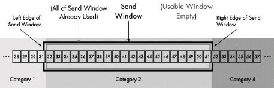
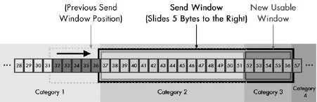

# TPC的流量控制和阻塞控制
## 滑动窗口

### 介绍
 
将TCP与UDP这样的简单传输协议区分开来的是它传输数据的质量。TCP对于发送数据进行跟踪，这种数据管理需要协议有以下两大关键功能：
**可靠性：**保证数据确实到达目的地。如果未到达，能够发现并重传。
**数据流控：**管理数据的发送速率，以使接收设备不致于过载。
要完成这些任务，整个协议操作是围绕滑动窗口确认机制来进行的。因此，理解了滑动窗口，也就是理解了TCP。

### 更多信息

**TCP面向流的滑动窗口确认机制:**

TCP将独立的字节数据当作流来处理。一次发送一个字节并接收一次确认显然是不可行的。即使重叠传输（即不等待确认就发送下一个数据），速度也还是会非常缓慢。

TCP消息确认机制如上图所示，首先，每一条消息都有一个识别编号，每一条消息都能够被独立地确认，因此同一时刻可以发送多条信息。设备B定期发送给A一条发送限制参数，制约设备A一次能发送的消息最大数量。设备B可以对该参数进行调整，以控制设备A的数据流。
为了提高速度，TCP并没有按照字节单个发送而是将数据流划分为片段。片段内所有字节都是一起发送和接收的，因此也是一起确认的。确认机制没有采用message ID字段，而是使用的片段内最后一个字节的sequence number。因此一次可以处理不同的字节数，这一数量即为片段内的sequence number。
 
**TCP数据流的概念划分类别**
假设A和B之间新建立了一条TCP连接。设备A需要传送一长串数据流，但设备B无法一次全部接收，所以它限制设备A每次发送分段指定数量的字节数，直到分段中已发送的字节数得到确认。之后，设备A可以继续发送更多字节。每一个设备都对发送，接收及确认数据进行追踪。
如果我们在任一时间点对于这一过程做一个“快照”，那么我们可以将TCP buffer中的数据分为以下四类，并把它们看作一个时间轴：

1. 已发送已确认 数据流中最早的字节已经发送并得到确认。这些数据是站在发送设备的角度来看的。如下图所示，31个字节已经发送并确认。
2. 已发送但尚未确认 已发送但尚未得到确认的字节。发送方在确认之前，不认为这些数据已经被处理。下图所示14字节为第2类。
3. 未发送而接收方已Ready 设备尚未将数据发出，但接收方根据最近一次关于发送方一次要发送多少字节确认自己有足够空间。发送方会立即尝试发送。如图，第3类有6字节。
4. 未发送而接收方Not Ready 由于接收方not ready，还不允许将这部分数据发出。

接收方采用类似的机制来区分已接收并已确认，尚未接受但准备好接收，以及尚未接收并尚未准备好接收的数据。实际上，收发双方各自维护一套独立的变量，来监控发送和接收的数据流落在哪一类。

**Sequence Number设定与同步：**

发送方和接收方必须就它们将要为数据流中的字节指定的sequence number达成一致。这一过程称为同步，在TCP连接建立时完成。为了简化假设第一个字节sequence number是1，按照上图示例，四类字节如下：

1. **已发送已确认:**字节1至31。
2. **已发送但尚未确认:**字节32至45。
3. **未发送而接收方已Ready:**字节46至51。
4. **未发送而接收方Not Ready:**字节52至95。

**发送窗口与可用窗口：**

整个过程关键的操作在于接收方允许发送方一次能容纳的未确认的字节数。这称为发送窗口，有时也称为窗口。该窗口决定了发送方允许传送的字节数，也是2类和3类的字节数之和。因此，最后两类（接收方准备好而尚未发送，接收方未准备好）的分界线在于添加了从第一个未确认字节开始的窗口。本例中，第一个未确认字节是32，整个窗口大小是20。
可用窗口的定义是：考虑到正在传输的数据量，发送方仍被允许发送的数据量。实际上等于第3类的大小。左边界就是窗口中的第一个字节（字节32），右边界是窗口中最后一个字节（字节51）。概念的详细解释看下图。

**可用窗口字节发送后TCP类目与窗口大小的改变：**

当上图中第三类的6字节立即发送之后，这6字节从第3类转移到第2类。字节变为如下：

1. 已发送已确认字节1至31。
2. 已发送但尚未确认字节32至51。
3. 未发送而接收方已Ready字节为0。
4. 未发送而接收方Not Ready字节52至95。

**确认处理以及窗口缩放：**

过了一段时间，目标设备向发送方传回确认信息。目标设备不会特别列出它已经确认的字节，因为这会导致效率低下。目标设备会发送自上一次成功接收后的最长字节数。

例如，假设已发送未确认字节（32至45）分为4段传输：32-34，35-36，37-41，42-45。第1，2，4已经到达，而3段没有收到。接收方只会发回32-36的确认信息。接收方会保留42-45但不会确认，因为这会表示接收方已经收到了37-41。这是很必要的，因为TCP的确认机制是累计的，只使用一个数字来确认数据。这一数字是自上一次成功接收后的最长字节数。假设目标设备同样将窗口设为20字节。

当发送设备接收到确认信息，则会将一部分第2类字节转移到第1类，因为它们已经得到了确认。由于5个字节已被确认，窗口大小没有改变，允许发送方多发5个字节。结果，窗口向右滑动5个字节。同时5个字节从第二类移动到第1类，5个字节从第4类移动至第3类，为接下来的传输创建了新的可用窗口。因此，在接收到确认信息以后，看起来如下图所示。字节变为如下：

1. 已发送已确认字节1至36。
2. 已发送但尚未确认字节37至51。
3. 未发送而接收方已Ready字节为52至56。
4. 未发送而接收方Not Ready字节57至95。

每一次确认接收以后，这一过程都会发生，从而让窗口滑动过整个数据流以供传输。

**处理丢失确认信息：**

但是丢失的42-45如何处理呢？在接收到第3段（37-41）之前，接收设备不会发送确认信息，也不会发送这一段之后字节的确认信息。发送设备可以将新的字节添加到第3类之后，即52-56。发送设备之后会停止发送，窗口停留在37-41。
TCP包括一个传输及重传的计时机制。TCP会重传丢失的片段。但有一个缺陷是：因为它不会对每一个片段分别进行确认，这可能会导致其他实际上已经接收到的片段被重传（比如42至45）。
## TCP的重传
### 介绍

TCP的主要任务是很简单：打包和发送数据。TCP与其他协议的不同之处在于使用滑动窗口来管理基本数据收发过程，同时确保数据流的有效及可靠传输，从而不致发送速率明显快于接收速率。本文将描述TCP是如何确保设备可靠、有效地进行传输的。首先阐述TCP检测丢失片段以及重传的基本方法，之后介绍TCP如何判断一个片段为丢失片段。

### 更多信息
 
**TCP片段重传计时器以及重传队列:**
 
检测丢失片段并对之重传的方法概念上是很简单的。每一次发送一个片段，就开启一个重传计时器。计时器有一个初始值并随时间递减。如果在片段接收到确认之前计时器超时，就重传片段。TCP使用了这一基本技术，但实现方式稍有不同。原因在于为了提高效率需要一次处理多个未被确认的片段，以保证每一个在恰当的时间重传。TCP按照以下特定顺序工作:

1. **放置于重传队列中，计时器开始** 包含数据的片段一经发送，片段的一份复制就放在名为重传队列的数据结构中，此时启动重传计时器。因此，在某些时间点，每一个片段都会放在队列里。队列按照重传计时器的剩余时间来排列，因此TCP软件可追踪那几个计时器在最短时间内超时。
2. **确认处理** 如果在计时器超时之前收到了确认信息，则该片段从重传队列中移除。
3. **重传超时** 如果在计时器超时之前没有收到确认信息，则发生重传超时，片段自动重传。当然，相比于原片段，对于重传片段并没有更多的保障机制。因此，重传之后该片段还是保留在重传队列里。重传计时器被重启，重新开始倒计时。如果重传之后没有收到确认，则片段会再次重传并重复这一过程。在某些情况下重传也会失败。我们不想要TCP永远重传下去，因此TCP只会重传一定数量的次数，并判断出现故障终止连接。
 
但是我们怎样知道一个片段被完全确认呢？重传是基于片段的，而TCP确认信息是基于序列号累积的。每次当设备A发送片段给设备B，设备B查看该片段的确认号字段。所有低于该字段的序列号都已经被设备A接收了。因此，当片段中所发送的所有字节的序列号都比设备A到设备B的最后一个确认号小的时候，一个从设备B发到设备A的片段被认为是确认了。这是通过计算片段中最后一个序列号结合片段的数据字段来实现的。

让我们以下图为例来说明一下确认和重传是怎样工作的。假设连接中的服务器发出了四个连续片段（号码从1开始）

**片段1** 序列号字段是1片段长度80。所以片段1中最后一个序列号是80。
**片段2** 序列号是81片段长度是120。片段2中最后一个序列号是200。
**片段3** 序列号是201片段长度是160。片段3中最后一个序列号是360。
**片段4** 序列号是361片段长度是140。片段3中最后一个序列号是500。

这些片段是一个接一个发送的，而无需等待前一个发送得到确认。这是TCP滑动窗口的一个主要优势。

假设客户端接收到前两个传输，它会发回一条确认消息确认号为201。从而告知服务器前两个片段已经被客户端成功接收了，它们从重传队列中移除（并且服务器发送窗口右移200字节）。在接收到确认号361或更高的片段之前，片段3会保留在重传队列中；片段4需要确认号501或更高。

现在，让我们进一步假设传输过程中片段3丢失了，但片段4被接收到了。客户端将片段4保存在接收buffer中，但是不需要确认，因为TCP是累积确认机制——确认片段4表示片段3也接收到了，但实际上并没有。因此，客户端需要等待片段3。实际上，服务器端片段3的重传计时器会超时，服务器之后重传片段3。之后客户端收到，然后发送片段3和4的确认信息给服务器。

还有一个重要的问题，服务器将如何处理片段4呢？虽然客户端在等待片段3，服务器没有收到反馈，所以它并不知道片段3丢失了，同样它也不知道片段4发生了什么（以及接下来传输的数据）。很有可能客户端已经接收到了片段4但是不能确认，也有可能片段4也丢失了。一些实现中会选择仅仅重传片段3，也有些会把3和4都重传。

最后一个问题是重传队列中所使用片段重传计时器的值。如果设置过低，会发生过量重传，如果设置过高，重传丢失片段会减弱性能。必须通过一个称为自适应重传的过程来动态调整这个值。

## TCP的确认

### 介绍
 
在TCP确认机制中，无法有效处理非连续TCP片段。确认号表明所有低于该编号的sequence number已经被发送该编号的设备接收。如果我们收到的字节数落在两个非连续的范围内，则无法只通过一个编号来确认。这可能导致潜在严重的性能问题，特别是高速或可靠性较差的网络。

### 更多信息
 
还是以下图为例，服务器发送了4个片段并收到1条回复，确认号为201。因此，片段1和片段2被当成已确认。它们从重传队列中移出，同时允许服务器发送窗口向右移动200字节，从而发送数据增加200个字节。

然而，再次假设片段3，从sequence number201开始，在发送过程中丢失了。由于客户端从没有收到这一片段，所以它也无法发送确认号高于201的确认信息，从而导致滑动窗口停滞。服务器可以继续发送其他片段直到填满客户端的接收窗口，但是直到客户端发送另一条确认信息，服务器的发送窗口都不会滑动。

另一个问题是如果片段3丢失了，客户端将无法告知服务器是否收到后续的片段。在客户端接收窗口填满之前，很有可能客户端已经接收到片段4以及之后的片段。但是客户端无法发送值为501的确认信息以表明接收到片段4，因为这意味着片段3也接收到了。
这里我们看到了TCP单编号，累积确认机制的缺点。我们可以想象一个最差的情况，服务器被告知它有一个10，000字节窗口，20个片段每个片段500字节。第一个片段丢失了，其他19个被接收到了。但是由于第一个片段从没有接收到，其他19个也无法确认。
 
 
**未确认片段处理策略：**
 
我们怎样处理丢失片段之后的片段呢？本例中，当服务器片段3重传超时，它必须决定怎样处理片段4，它不知道客户端是否已经接收到。在上述最差情况下，第一个片段丢失后，其余19个可能或可能无法被客户端接收到。
**处理这种情况有两种可能的方式：**

1. **仅重传超时片段：**这是一种更加保守的方式，仅重传超时的片段，希望其他片段都能够成功接收。如果该片段之后的其他片段实际上接收到了，这一方式是最佳的，如果没接收到，就无法正常执行。后者的情况每一个片段需要单独计时并重传。假设上述最坏情况下，所有20个500字节片段都丢失了。我们需要等片段1超时并重传。这一片段也许会得到确认，但之后我们需要等待片段2超时并重传。这一过程会重复多次。

2. **重传所有片段：**这是一种更激进或者说更悲观的方式。无论何时一个片段超时了，不仅重传该片段，还有所有其他尚未确认的片段。这一方式确保了任何时间都有一个等待确认的停顿时间，在所有未确认片段丢失的情况下，会刷新全部未确认片段，以使对端设备多一次接收机会。在所有20个片段都丢失的情况下，相对于第一种方式节省了大量时间。这种方式的问题在于可能这些重传是不必要的。如果第一个片段丢失而其他19个实际上接收到了，也得重传那9500字节数据。

由于TCP不知道其他片段是否接收到，所以它也无法确认哪种方法更好，但只能选择一种方式。上图示例了保守的方式，而下图显示的是激进的方式：

问题的关键在于无法确认非连续片段。解决方式是对TCP滑动窗口算法进行扩展，添加允许设备分别确认非连续片段的功能。这一功能称为选择确认（selective acknowledgment, SACK）。

**选择确认：**

通过SACK，连接的两方设备必须同时支持这一功能，通过连接时使用的SYN片段来协商是否允许SACK。这一过程完成之后，任一设备都可以在常规TCP片段中使用SACK选项。这一选项包含一个关于已接收但未确认片段数据sequence number范围的列表，由于它们是非连续的。
各设备对重传队列进行修改，如果该片段已被选择确认过，则该片段中的SACK比特位置为1。该设备使用图2中激进方式的改进版本，一个片段重传之后，之后所有片段也会重传，除非SACK比特位为1。

例如，在4个片段的情况下，如果客户端接收到片段4而没有接收到片段3，当它发回确认号为201（片段1和片段2）的确认信息，其中包含一个SACK选项指明：“已接收到字节361至500，但尚未确认”。如果片段4在片段1和2之后到达，上述信息也可以通过第二个确认片段来完成。服务器确认片段4的字节范围，并为片段4打开SACK位。当片段3重传时，服务器看到片段4的SACK位为1，就不会对其重传。如下图所示。

在片段3重传之后，片段4的SACK位被清除。这是为了防止客户端出于某种原因改变片段4已接收的想法。客户端应当发送确认号为501或更高的确认信息，正式确认片段3和4接收到。如果这一情况没有发生，服务器必须接收到片段4的另一条选择确认信息才能将它的SACK位打开，否则，在片段3重传时或计时器超时的情况下会对其自动重传。

## TCP的流量控制
### 介绍

前文已经介绍过了TCP滑动窗口大小的重要性。在客户端与服务器的连接中，客户端告知服务器它一次希望从服务器接收多少字节数据，这是客户端的接收窗口，即服务器的发送窗口。类似地，服务器告知客户端一次希望从客户端接收多少字节数据，也就是服务器的接收窗口和客户端的发送窗口。
要理解为什么窗口大小会产生波动，首先需要理解它的含义。最简单的方式是它代表了设备对于特定连接的接收缓存大小。即，窗口大小代表一个设备一次能够从对端处理多少数据，之后再传递给应用层处理。

### 更多信息

当服务器从客户端接收数据，它就将数据放在缓存中，服务器必须对数据做以下两步操作：
确认：服务器必须将确认信息发回客户端以表明数据接收。
传输：服务器必须处理数据，将它传递给目标应用程序处理。

区分开这两件事情是非常重要的。关键在于基本的滑动窗口机制中，数据于接收时确认，但并不一定立即从缓存中传输出去。也就意味着当接收数据速度快于接收TCP处理速度时，缓存有可能被填满。当这一情况发生时，接收设备需要调整窗口大小已防止缓存过载。

由于窗口大小能够以这种方式管理连接两端设备数据流的速率，TCP就是以这种方式实现流控这一传输层非常典型的任务。流控对于TCP来说是很重要的，因为它是设备间互通状态的方式。通过增加或缩小窗口大小，服务器和客户端能够确保对端发送数据的速度等同于处理速度。

**减小窗口大小以降低发送速率：**

首先看一下客户端到服务器的数据传输，如下图所示。

客户端传输140字节数据至服务器。之后，客户端的可用窗口还剩下220字节：发送窗口的360字节减去发送的140字节。

一段时间过后，服务器接收到140字节并将它们放在缓存中。现在，理想的情况下，140字节进入缓存，确认之后立刻从缓存移出。也就是说，缓存有足够的大小来容纳客户端发送的所有数据。缓存的空闲空间维持在360字节，因此告知客户端窗口大小保持不变。

只要服务器处理速度和数据进入速度相同，窗口大小就会保持在360字节。客户端在接收到140字节的确认信息以及窗口大小保持不变的信息之后，将360字节窗口向右移动140字节。由于现在未确认字节数为0，因此客户端又可以发送360字节数据。对应于之前可用窗口的220字节，加上刚刚确认的140字节数据。

然而，现实中服务器可能需要处理数十，数百乃至数千个TCP连接。TCP可能无法立刻处理数据，或应用应用程序本身无法接收140字节数据。任何一种情况下，服务器TCP都无法立刻将140字节从缓存中移出。这时，除了发回确认信息给客户端以外，服务器会想要告知客户端更改窗口大小，以表示缓存已经被部分写入了。

假设我们接收到140字节，但只能发送40字节给应用程序，缓存中剩下100字节。当发送140字节的确认信息，服务器将发送窗口缩小100字节，至260字节。当客户端从服务器接收到这一片段，它将会看到140字节的确认信息并将窗口向右滑动140字节。在滑动过程中，将大小缩减至260字节。可以认为将窗口左端滑动140字节，但右端仅滑动40字节。新的稍小一些的窗口保证服务器从客户端接收最多260字节数据，以适应接收缓存中的剩余空间，如下图的1-3步所示。

**缩减发送窗口以停止发送新数据：**

如果服务器无法接收任何新数据会怎么样呢？假设客户端下一次传输180字节，但是服务器太忙碌而无法对其进行处理。这种情况下，服务器将这180字节缓存下来，并且在确认信息中，将窗口大小从260字节缩减为80字节。当客户端接收到180字节的确认信息，它也会看到窗口缩减了180字节，它会滑动与缩减同样的大小，告知服务器：我确认接收180字节数据，但不允许你再发送新的数据。也可以看作窗口左端滑动180字节，但右端维持不动。只要右端不移动，客户端就无法发送更多数据。这一过程显示在上图的4-6中。

**关闭发送窗口：**

窗口调整可以通过双方设备来完成。如果服务器从客户端接收的数据持续快于推送给应用的速率，则服务器将会继续减小接收窗口。假设发送窗口减小至80字节，客户端发送第三个请求，长度为80字节，但服务器仍处于繁忙状态。之后服务器将窗口减小为0，也称为关闭窗口。这一信息告知客户端服务器已经过载，它需要彻底停止发送数据，如上图最后一步所示。之后，当服务器负载减轻时，可以再次增加这一连接的窗口，允许更多数据传输。

## TCP阻塞控制

### 介绍

我们知道, 网络层的IP协议是不可靠的，没有提供可靠数据传输的机制，而传输层的TCP却提供了可靠数据传输的机制，依靠错误检测、超时、重传、流量控制和阻塞控制等等。正是因为如此，TCP比UDP复杂得多。
**阻塞**，是通信子网中某一部分接受到的数据包过多，速率超过了它的处理速度，而我们知道，网络中路由器或中继器的缓冲是有限的，因此当缓存已满时，后面发送的数据包则会丢失，因而发生丢包现象。阻塞控制，就是控制在通信子网中传输的数据包的数量，以尽量不发生网络阻塞以致频繁的丢包现象。那TCP是如何进行阻塞控制的呢？

TCP必须使用端到端的控制，因为网络层本身不提供关于网络阻塞的反馈。阻塞控制就是要使TCP发送数据包的速率有所限制。TCP是如何知道网络中发生了阻塞呢？超时很可能说明网络发生了阻塞，而且运用TCP进行通信的接收方的ACK是累加性的，即它只接收它认定的下一个数据包（假如接收方最近发送的ACK确认包序号为x，当前要接收的Seq序号为y的数据包，如果超前接受到大于y的，则接收方返回序号为x的ACK包），则当发送方收到重复ACK包时，网络也很有可能阻塞。TCP是通过阻塞窗口CongWin来进行阻塞控制的，就是网络中的未ACK的数据包最多有CongWin个。假设TCP最近接收到的ACK为lastByteAcked，最近发送的数据为lastByteSent，假如阻塞窗口大小为CongWin，则有lastByteSent - lastByteAcked <= CongWin。

TCP阻塞控制有AIMD算法，就是当没发生丢失（没有超时和收到三次重复ACK）时，阻塞窗口大小是线性累加的(通常是每个RTT增加1MSS），当发生丢失现象时（超时和三次重复ACK），阻塞窗口大小减为原来的一半。

慢启动就是开始时阻塞窗口大小由1MSS开始指数增长，当达到threshold之后开始线性增加。根据对Timeout事件反应的不同，TCP阻塞控制算法有TCP Tahoe和TCP Reno。TCP Tahoe比较保存，发生超时或收到三次重复ACK后，阻塞窗口都减到1MSS大小，然后慢启动，至于TCP Reno，只有超时现象发生时才减到1MSS，因此它认为收到三次重复ACK说明在那个丢失包的后面发送的数据包有些到达了接收方。当发生超时或三次重复ACK时，threshold变为当前窗口的一半，其余时刻不变。

### 网络拥堵
现在网络上大部分的网络请求都是以TCP的方式进行传输的了。网络链路是固定的，各种链路情况也是不一样的。网络拥堵一直是TCP协议设计和使用的时候尽力要避免的。比如，从TCP协议的网络包协议设计来看，TCP使用一发一答的ACK的网络包确认方式，而不是使用NAK这种会增加确认包的方式来做确认机制。这个就是在尽力降低网络上的包传递数量，避免网络拥堵。

**还有哪些控制网络拥堵的方式呢？**

#### s慢启动
当一个连接连接上网络的时候，并不应该一次向网络中就发送大量的数据包，否则的话，如果网络链路状况不是很好的情况，这些网络包可能会加重网络拥堵的情况。所以最初TCP连接建立之后，发送网络包的大小是逐渐增长的，最开始是1个最大报文大小，然后是指数级增长。这个就是慢启动机制。

但是到了一个数值，就不能再进行指数增长了，这个时候，网络包增长就从指数增长改成线性增长，就是一次增加一个MSS。这个就是拥塞避免阶段。

##### Nagle算法
如果互联网上传递的都是小包，那绝对是个灾难，每个网络请求都耗费比较大的资源，如果一份数据分为零零散散很多份小包，每个网络传输都只传输一个小包，那么是典型的浪费资源，增加拥堵。糊涂窗口综合症就是发送方和接收方糊里糊涂达成的协商是传送小包。

为了解决这个问题，很多方法应运而生，Nagle算法就是其中一个方法。

Nagle算法规定了，发送方网络链路上一个连接只能有一个未获得ACK的请求包。这个就意味着，发送方只有等待上一个请求的ACK回来之后才能发送下一个请求，这样两个请求过程中间，发送方的缓存区就存储了足够滑动窗口大小的包进行传递，这样就有效避免了大量的小包产生。

#### Cork算法
另外一种解决糊涂窗口综合症的方法就是Cork算法。这个算法比Nagle算法更激进一些，干脆直接计算出一个值，当发送方的滑动窗口大小小于这个值的时候，不进行数据包的发送。这样这个算法就能有效直接杜绝小包的出现了。当然可能会导致数据有一定的延迟性了。

Nagle和Cork算法都是在发送方进行控制，两个算法的着重点不同，Cork算法着重点在于避免小包，更多是端到端的优化。Nagle算法则是为了提高网络的利用率。

#### 延迟ACK
从接收方也有能力防止糊涂窗口综合症。延迟ACK算法就是接收方并不是收到请求之后立刻发送ACK，而是开启一个计时器，等到计时器结束的时候，才发送ACK。或者是接收方在需要回发送请求的时候，顺带着把上个请求的ACK发送回去了。这个机制如果配合Nagle算法，能让连接的滑动窗口达到一个预期的比较好的值。

#### 重传机制
上面都是防止阻塞的方法，但是万一阻塞了呢？发出去的请求包在规定时间内没有收到ACK，不管是请求包丢失，还是ACK包丢失，还是网络延迟，总之，这里都是需要有个重传机制的。TCP的重传机制有两种：超时重传和快速重传。

#### 超时重传
说白了就是在请求包发出去的时候，开启一个计时器，当计时器达到时间之后，没有收到ACK，则就进行重发请求的操作，一直重发直到达到重发上限次数或者收到ACK。

#### 快速重传
还有一种机制就是快速重传，当接收方收到的数据包是不正常的序列号，那么接收方会重复把应该收到的那一条ACK重复发送，这个时候，如果发送方收到连续3条的同一个序列号的ACK，那么就会启动快速重传机制，把这个ACK对应的发送包重新发送一次。

**参考:**
[TCP的阻塞和重传机制](http://www.cnblogs.com/yjf512/p/5680689.html)
[网络基本功](https://community.emc.com/message/840427#840427)
[TCP阻塞控制](http://blog.csdn.net/liaoxr/article/details/7015871)