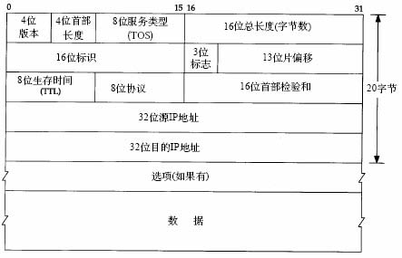

# ip报文

　IP协议是TCP/IP协议中的核心协议。所有TCP，UDP，ICMP，IGMP数据都通过IP数据报传输，但是IP不保证能够到达目的地址，并且IP不保证到达的顺序，所以需要上层的协议（通常是TCP）来处理这些潜在的问题，以便为应用提供无差错的交付。
## IP报头
　

- 版本：占4位（bit），指IP协议的版本号。目前的主要版本为IPV4，即第4版本号，也有一些教育网和科研机构在使用IPV6。在进行通信时，通信双方的IP协议版本号必须一致，否则无法直接通信。

- 首部长度：占4位（bit），指IP报文头的长度。最大的长度（即4个bit都为1时）为15个长度单位，每个长度单位为4字节（TCP/IP标准，DoubleWord），所以IP协议报文头的最大长度为60个字节，最短为上图所示的20个字节，这个字段正常字段为5（这里的单位为4字节）。

- 服务类型：占8位（bit），用来获得更好的服务。其中的前3位表示报文的优先级，后面的几位分别表示要求更低时延、更高的吞吐量、更高的可靠性、更低的路由代价等。对应位为1即有相应要求，为0则不要求。

- 总长度：16位（bit），指报文的总长度。注意这里的单位为字节，而不是4字节，所以一个IP报文的的最大长度为65535个字节。

- 标识（identification）：该字段标记当前分片为第几个分片，在数据报重组时很有用。

- 标志（flag）：该字段用于标记该报文是否为分片（有一些可能不需要分片，或不希望分片），后面是否还有分片（是否是最后一个分片）。

- 片偏移：指当前分片在原数据报（分片前的数据报）中相对于用户数据字段的偏移量，即在原数据报中的相对位置。

- 生存时间：TTL（Time to Live）。该字段表明当前报文还能生存多久。每经过1ms或者一个网关，TTL的值自动减1，当生存时间为0时，报文将被认为目的主机不可到达而丢弃。 使用过Ping命令的用户应该有印象，在windows中输入ping命令，在返回的结果中即有TTL的数值。

- 协议：该字段指出在上层（网络7层结构或TCP/IP的传输层）使用的协议，可能的协议有UDP、TCP、ICMP、IGMP、IGP等。

- 首部校验和：用于检验IP报文头部在传播的过程中是否出错，主要校验报文头中是否有某一个或几个bit被污染或修改了。

- 源IP地址：32位（bit），4个字节，每一个字节为0～255之间的整数，及我们日常见到的IP地址格式。

- 目的IP地址：32位（bit），4个字节，每一个字节为0～255之间的整数，及我们日常见到的IP地址格式。

## IP的在linux中的结构

```c
typedef struct ip
{
    u_int ip_v:4; //version(版本)
    u_int ip_hl:4; //header length(报头长度)
    u_char ip_tos; //服务类型
    u_short ip_len;//总长度
    u_short ip_id; //标志
    u_short ip_off; //分片偏移
    u_char ip_ttl; //生存时间
    u_char ip_p; //协议
    u_short ip_sum; //效验和
    struct in_addr ip_src; //源ip地址
    struct in_addr ip_dst;	//目标ip地址
}IP_HEADER;
```
