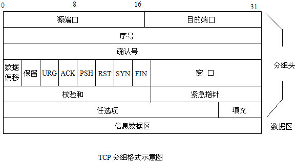
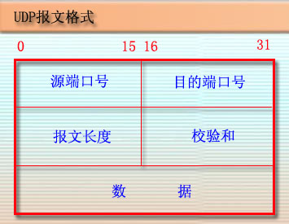

#TCP，UDP报文详解

##TCP报文介绍

　　TCP是一种可靠的、面向连接的字节流服务。
　　源主机在传送数据前需要先和目标主机建立连接。然后，在此连接上，被编号的数据段按序收发。同时，要求对每个数据段进行确认，保证了可靠性。如果在指定的时间内没有收到目标主机对所发数据段的确认，源主机将再次发送该数据段。

##TCP报文结构
TCP头部他的标准长度是20字节。除非出现选项，头部字段以32位为单位给出头部大小（最小值是5）。

　

- 源端口

- 目的端口

- 序列号
　　此次发送的数据在整个报文段中的起始字节数。此序号用来标识从tcp发送端向tcp接受端发送的数据字节流，seq表示在这个报文段中的第一个数据字节。如果将字节流看做在两个应用程序间的单向流动，则tcp用序号对每个字节进行计数。32 bit的无符号数。为了安全起见，它的初始值是一个随机生成的数，它到达2的32次方-1后又从零开始。

- 确认号
　　是下一个期望接收的字节，确认序号应当是上次已成功接收的序号+1，只有ack标志为1时确认序号字段才有效。一旦一个连接已经建立了，ack总是=1

- 头部长度
　　头部长度给出了头部的长度，以32位字为单位。他是必需的，因为选项长度是可以变得。作为一个4位的字段TCP被限制为只能带60字节的头部。而不带选项大小是20字节。

- 保留位
	在TCP/IP详解卷中为4位保留位和8个标志位其中在老的实现中只理解最后的6位。
    前两个不常用的包括：
	- CWR: 拥塞窗口减（发送方降低它的发送速率
	- ECE: ECN回显（发送方接受到了一个更早的拥塞通告


- fin, syn, rst, psh, ack, urg6个标志位
    这6个位域已经保留了超过四分之一个世纪的时间而仍然原封未动，这样的事实正好也说明了TCP的设计者们考虑的是多么的周到。它们的含义如下：
	- FIN:：位被用于释放一个连接。它表示发送方已经没有数据要传输了。
    - SYN：同步序号，用来发起一个连接。syn位被用于建立连接的过程。在连接请求中，syn=1; ack=0表示该数据段没有使用捎带的确认域。连接应答捎带了一个确认，所以有syn=1; ack=1。本质上，syn位被用来表示connection request和connection accepted，然而进一步用ack位来区分这两种情况。
    - RST：该为用于重置一个已经混乱的连接，之所以会混乱，可能是由于主机崩溃，或者其他的原因。该位也可以被用来拒绝一个无效的数据段，或者拒绝一个连接请求。一般而言，如果你得到的数据段设置了rst位，那说明你这一端有了问题。
    - PSH：接收方在收到数据后应立即请求将数据递交给应用程序，而不是将它缓冲起来直到整个缓冲区接收满为止(这样做的目的可能是为了效率的原因)
    - AVK：ack位被设置为1表示tcphdr->ack_seq是有效的。如果ack为0，则该数据段不包含确认信息，所以，tcphdr->ack_seq域应该被忽略。
    - URG：紧急指针有效

- 窗口大小
　　TCP流量控制的一个手段，用来告诉对端TCP缓冲区还能容纳多少字节

- 效验和
　　校验和校验的是整个tcp报文段，包括tcp首部和tcp数据，这是一个强制性的字段，一定是由发端计算和存储，并由收端进行验证。

- 紧急指针
   只有在URG位字段被设置时才有效。这个指针是一个必须要加到报文段的序列号字段上的正偏移量，以产生紧急数据的最后一个字节的序列号

- 选项字段
　　最常见的选项字段就是“最大段大小”选项，称为MSS。连接的每个端点一般在它发送的第一个报文段（为了借案例该连接，SYN位字段被设置的那个报文段）上制定这个选项,MSS指定该选项的发送者在相反方向上希望接收到的报文段的最大值。

## tcp在linux中的结构


```c
struct tcphdr {
    __be16 source;//  16位源端口号
    __be16 dest; //16位目的端口号
    __be32 seq; //序列号
    __be32 ack_seq; //确认号
#if defined(__LITTLE_ENDIAN_BITFIELD)
    __u16   res1:4,//保留位
            doff:4, //tcp报头长度
            fin:1,
            syn:1,
            rst:1,
            psh:1,
            ack:1,
            urg:1,
            ece:1,
            cwr:1;
#elif defined(__BIG_ENDIAN_BITFIELD)
    __u16   doff:4,
            res1:4,
            cwr:1,
            ece:1,
            urg:1,
            ack:1,
            psh:1,
            rst:1,
            syn:1,
            fin:1;
#else
#error "Adjust your <asm/byteorder.h> defines"
#endif
    __be16 window;//窗口大小
    __be16 check;//效验和
    __be16 urg_ptr;//紧急指针
};
```


# udp报文

##UDP报文介绍

UDP协议是提供与IP一样的不可靠，无连接的交付服务，UDP报文可能出现丢失，重复或者乱序到达等现象。

UDP协议在IP协议上增加了复用、分用和差错检测功能。UDP的特点：

1. 是无连接的。相比于TCP协议，UDP协议在传送数据前不需要建立连接，当然也就没有释放连接。
2. 是尽最大努力交付的。也就是说UDP协议无法保证数据能够准确的交付到目的主机。也不需要对接收到的UDP报文进行确认。
3. 是面向报文的。也就是说UDP协议将应用层传输下来的数据封装在一个UDP包中，不进行拆分或合并。因此，运输层在收到对方的UDP包后，会去掉首部后，将数据原封不动的交给应用进程。
4. 没有拥塞控制。因此UDP协议的发送速率不送网络的拥塞度影响。
5. UDP支持一对一、一对多、多对一和多对多的交互通信。
6. UDP的头部占用较小，只占用8个字节。

## UDP报文结构

- 源端口：源端口号。在需要对方回信时选用。不需要时可用全0。
- 目的端口：目的端口号。这在终点交付报文时必须要使用到。
- 长度： UDP用户数据报的长度，其最小值是8（仅有首部）。
- 校验和：检测UDP用户数据报在传输中是否有错。有错就丢弃。

　　

## UDP报文在linux中的应用
```c
typedef struct udphdr
{
    u_short uh_sport;//源端口地址
    u_short uh_dport;//目的端口地址
    u_short uh_ulen;//UD报文长度
    u_short uh_sum;//16位校验和
}UDP_HEADER;
```
## 伪报头

在 TCP 的分段或 UDP 的数据报格式中，在数据报首部前面增加源 IP 地址、目的 IP 地址、IP 分组的协议字段、TCP 或 UDP 数据报的总长度等共12字节，所构成的扩展首部结构。此伪首部是一个临时的结构，它既不向上也不向下传递，仅仅只是为了保证可以校验套接字的正确性。


