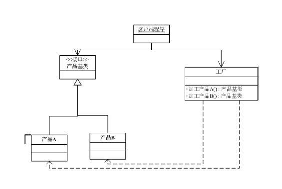
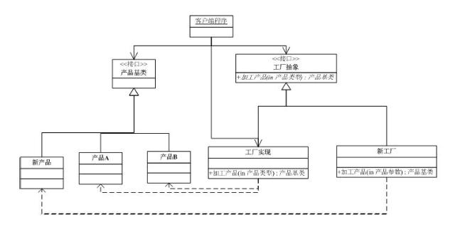
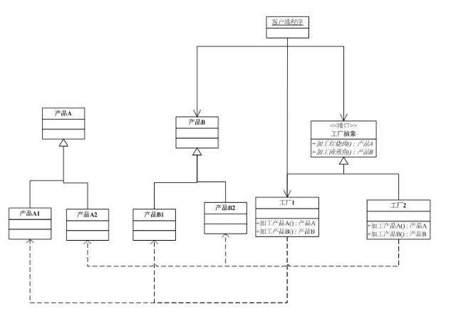

#三种工厂模式的对比
## 简单工厂模式
1. 介绍：

	简单工厂模式是由一个工厂对象决定创建出哪一种产品类的实例。简单工厂模式是工厂模式家族中最简单实用的模式，可以理解为是不同工厂模式的一个特殊实现。
2. 意图:

	把一系列拥有共同特征的产品的创建封装
3. UML图:


4. 简单工厂的优点/缺点：
	- 优点：工厂类含有必要的判断逻辑，可以决定在什么时候创建哪一个产品类的实例，客户端可以免除直接创建产品对象的责任，而仅仅"消费"产品。
	- 缺点：对修改不封闭，新增加产品要修改工厂。违法了鼎鼎大名的开闭法则（OCP）。另外，简单工厂模式通常使用静态工厂方法，这使得无法由子类继承，造成工厂角色无法形成基于继承的等级结构。

5.　简单工厂的实现：

```c++
#include<iostream>
#include<cstdio>
using namespace std;
//产品基类（接口）
class product{
protected:
	product(){};
public:
virtual ~product(){};
virtual void function()= 0;
};
//具体产品的创建和实现
class concrete_productA:public product{
public:
	concrete_productA(){cout<<"create a product A"<<endl;}
	~concrete_productA(){}
public:
	virtual void function(){}

};
class concrete_productB:public product{
public:
	concrete_productB(){cout<<"create a procduct B"<<endl;}
	~concrete_productB(){}
public:
	virtual void function(){}
};
//简单工厂
class simple_factory{
public:
	simple_factory(){}
	~simple_factory(){}
public:
	product* create_product(int type);
	product* create_productA(){return new concrete_productA();}
	product* create_productB(){return new concrete_productB();}
};
product* simple_factory::create_product(int type){
	product *p =nullptr;
	switch(type){
		case 0:
			p = new concrete_productA();
			break;
		case 1:
			p = new concrete_productB();
			break;
		default:
			p = new concrete_productA();
			break;
	}
	return p;
}
int main(){
	simple_factory factory;
	product *p1 = factory.create_product(0);
	product *p2 = factory.create_product(1);
	delete p1;
	delete p2;
}

```

## 工厂方法模式

1. 介绍：

	工厂方法模式(Factory Method)，又称多态性工厂模式。在工厂方法模式中，核心的工厂类不再负责所有的产品的创建，而是将具体创建的工作交给子类去做。该核心类成为一个抽象工厂角色，仅负责给出具体工厂子类必须实现的接口，而不接触哪一个产品类应当被实例化这种细节。
2. 意图:

	定义一个用户创建对象的接口，让子类决定实例化哪一个类。Factory Method使一个类的实例化延迟到其子类。

3. UML图:


4. 工厂方法的优缺点：
	- 优点：
	简单工厂具有的优点。
	解决了简单工厂的修改不能关闭的问题。系统新增产品，新增一个产品工厂即可，对抽象工厂不受影响。
	- 缺点：
	对于创建不同系列的产品无能为力。

5. 工厂模式的实现

```
#include<iostream>
using namespace std;
//产品基类(接口)
class product{
protected:
	product(){}
public:
	virtual ~product(){}
public:
	virtual void function()=0;
};
//产品实际构造
class concrete_productA:public product{
public:
	concrete_productA(){cout<<"create a product A"<<endl;}
	~concrete_productA(){}
public:
	virtual void function(){}
};
class concrete_productB:public product{
public:
	concrete_productB(){cout<<"create a product B"<<endl;}
	~concrete_productB(){}
public: 
	virtual void functisahnon(){}
};
//新增加的产品Ｃ和Ｄ
class concrete_productC:public product{
public:
	concrete_productC(){cout<<"create a product C"<<endl;}
	~concrete_productC(){}
public:
	virtual void function(){}
};
class concrete_productD:public product{
public:
	concrete_productD(){cout<<"create a product D"<<endl;}
	~concrete_productD(){}
public:
	virtual void function(){}
};
//工厂基类（接口）
class factory{
public:
	factory(){}
	virtual ~factory(){}
public:
	virtual product* create_product(int type)=0;
};
//曾经的工厂
class concrete_factory1:public factory{
public:
	concrete_factory1(){}
	virtual ~concrete_factory1(){}
public:
	product *create_product(int type);
};
product* concrete_factory1::create_product(int type)
{
	product* p =nullptr;
	switch(type){
		case 0:
			p = new concrete_productA();
			break;
		case 1:
			p = new concrete_productB();
			break;
		default:
			p = new concrete_productA();
			break;
	}
	return p;
			
}
//增加新的产品所构建的工厂，产生Ｃ和Ｄ产品
class concrete_factory2:public factory{
public:
	concrete_factory2(){}
	virtual ~concrete_factory2(){}
public:
	product *create_product(int type);
};
product * concrete_factory2::create_product(int type)//０生产ｃ，１生产Ｄ
{
	product *p = nullptr;
	switch(type){
		case 0:
			p = new concrete_productC();
			break;
		case 1:
			p = new concrete_productD();
			break;
		default:
			p = new concrete_productC();
			break;
	}	
	return p;
}
int main()
{
	factory *f1 = new concrete_factory1();
	product *f1a = f1->create_product(0);
	product *f1b = f1->create_product(1);
	factory *f2 = new concrete_factory2();
	product *f2c = f2->create_product(0);
	product *f2d = f2->create_product(1);
	
}


```
## 抽象工厂模式

1. 介绍：

	抽象工厂模式是所有形态的工厂模式中最为抽象和最具一般性的一种形态。抽象工厂模式是指当有多个抽象角色时，使用的一种工厂模式。抽象工厂模式可以向客户端提供一个接口，使客户端在不必指定产品的具体的情况下，创建多个产品族中的产品对象。根据里氏替换原则，任何接受父类型的地方，都应当能够接受子类型。因此，实际上系统所需要的，仅仅是类型与这些抽象产品角色相同的一些实例，而不是这些抽象产品的实例。换言之，也就是这些抽象产品的具体子类的实例。工厂类负责创建抽象产品的具体子类的实例。
2. 意图

	提供一个创建一系列相关或相互依赖对象的接口，而无需指定它们具体的类。
3. UML图:

4.抽象工厂的优缺点
	- 优点：
	抽象工厂模式隔离了具体类的生产，使得客户并不需要知道什么被创建。
	当一个产品族中的多个对象被设计成一起工作时，它能保证客户端始终只使用同一个产品族中的对象。
	增加新的具体工厂和产品族很方便，无须修改已有系统，符合“开闭原则”。
	- 缺点：
	难以支持新种类的产品。难以扩展抽象工厂以生产新种类的产品。这是因为抽象工厂几口确定了可以被创建的产品集合，支持新种类的产品就需要扩展该工厂接口，这将涉及抽象工厂类及其所有子类的改变。
5. 应用场景
	- 支持多种观感标准的用户界面工具箱（Kit）。
	- 游戏开发中的多风格系列场景，比如道路，房屋，管道等。

6.　抽象工厂方法的实现:

```
#include<iostream>
using namespace std;
//抽象的产品类
class product{
protected:
	product(){}
public:
	virtual ~product(){}
	virtual void function()=0;
};
//真实的构造基本的A产品
class concrete_productA:public product{
public:
	concrete_productA(){}
	virtual ~concrete_productA(){};
public:
	virtual void function(){}
};
//根据1工厂扩展实现A1产品
class concrete_productA1:public concrete_productA{
public:
	concrete_productA1(){cout<<"create a product A1"<<endl;}
	virtual ~concrete_productA1(){}
public:
	virtual void function(){}
};
//根据2工厂扩展实现A2产品
class concrete_productA2:public concrete_productA{
public:
	concrete_productA2(){cout<<"create a product A2"<<endl;}
	virtual ~concrete_productA2(){}
public:
	virtual void function(){}
};
//真实的构造基本的B产品
class concrete_productB:public product{
public:
	concrete_productB(){}
	virtual ~concrete_productB(){}
public:
	virtual void function(){};
};
//根据工厂1实现具体的B1产品
class concrete_productB1:public concrete_productB{
public:
	concrete_productB1(){cout<<"create a product B1"<<endl;}
	virtual ~concrete_productB1(){}
public:
	virtual void function(){}
};
//根据工厂2实现具体的B2产品
class concrete_productB2:public concrete_productB{
public:
	concrete_productB2(){cout<<"create a product B2"<<endl;}
	virtual ~concrete_productB2(){}
public:
	virtual void function(){}
};
//抽象的工厂类
class abstract_factory{
public:
	abstract_factory(){}
	virtual ~abstract_factory(){}
public:
	virtual concrete_productA *create_productA()=0;
	virtual concrete_productB *create_productB()=0;
};
//具体的工厂1的实现
class concrete_factory1:public abstract_factory{
public:
	concrete_factory1(){}
	virtual ~concrete_factory1(){}
public:
	virtual concrete_productA *create_productA(){return new concrete_productA1();}
	virtual concrete_productB *create_productB(){return new concrete_productB1();}
};
//具体的工厂2的实现
class concrete_factory2:public abstract_factory{
public:
	concrete_factory2(){}
	virtual ~concrete_factory2(){}
public:
	virtual concrete_productA *create_productA(){return new concrete_productA2();}
	virtual concrete_productB *create_productB(){return new concrete_productB2();}
};
int main()
{
	abstract_factory *absf1 = new concrete_factory1();
	concrete_productA *absfa1 = absf1->create_productA();
	concrete_productB *absfb1 = absf1->create_productB();
	abstract_factory *absf2 = new concrete_factory2();
	concrete_productA *absfa2 = absf2->create_productA();
	concrete_productB *absfb2 = absf2->create_productB(); 
}

```

参考文献：