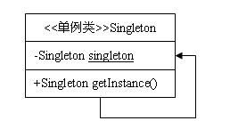

#设计模式－单例模式

## 介绍
1. 意图：保证一个类仅有一个实例，并提供一个访问它的全局访问点。
2. 主要解决：一个全局使用的类频繁地创建与销毁。
3. 何时使用：当您想控制实例数目，节省系统资源的时候。
4. 如何解决：判断系统是否已经有这个单例，如果有则返回，如果没有则创建。
5. 关键代码：构造函数是私有的。
6. 应用实例： 1、一个党只能有一个主席。 2、Windows 是多进程多线程的，在操作一个文件的时候，就不可避免地出现多个进程或线程同时操作一个文件的现象，所以所有文件的处理必须通过唯一的实例来进行。 3、一些设备管理器常常设计为单例模式，比如一个电脑有两台打印机，在输出的时候就要处理不能两台打印机打印同一个文件。
7. 单例模式的优缺点：
	- 优点： 1、在内存里只有一个实例，减少了内存的开销，尤其是频繁的创建和销毁实例（比如管理学院首页页面缓存）。 2、避免对资源的多重占用（比如写文件操作）。
	- 缺点：没有接口，不能继承，与单一职责原则冲突，一个类应该只关心内部逻辑，而不关心外面怎么样来实例化。
8. 使用场景： 1、要求生产唯一序列号。 2、WEB 中的计数器，不用每次刷新都在数据库里加一次，用单例先缓存起来。 3、创建的一个对象需要消耗的资源过多，比如 I/O 与数据库的连接等。
9. 注意事项：getInstance() 方法中需要使用同步锁 synchronized (Singleton.class) 防止多线程同时进入造成 instance 被多次实例化。

##　实现

ＵＭＬ图：


### 懒汉式，线程不安全
1. 描述：

	这种方式是最基本的实现方式，这种实现最大的问题就是不支持多线程。因为没有加锁 synchronized，所以严格意义上它并不算单例模式。
2. 代码实现：

```c++
class singleton{
public:
	static singleton* get_instance();
	void sendmessage(){cout<<"hello"<<endl;}
protected:
	singleton(){}
private:
	static singleton* _instance;

};
singleton *singleton::_instance = 0;
singleton* singleton::get_instance(){
	if(_instance==nullptr){
		_instance = new singleton();
	}
	return _instance;
}
```
### 懒汉式，线程安全

1. 描述：
	这种方式具备很好的 lazy loading，能够在多线程中很好的工作，但是，效率很低，99% 情况下不需要同步。
	- 优点：第一次调用才初始化，避免内存浪费。
	- 缺点：必须加锁才能保证单例，但加锁会影响效率。
	getInstance() 的性能对应用程序不是很关键（该方法使用不太频繁）。

2. 代码实现：

```c++
class singleton{
public:
	static singleton* get_instance();
	void sendmessage(){cout<<"hello"<<endl;}
protected:
	singleton(){}
private:
	static singleton* _instance;

};
singleton *singleton::_instance = 0;
singleton* singleton::get_instance(){
	Lock();//借用其它类来实现，如boost
	if(_instance==nullptr){
		_instance = new singleton();
	}
	UnLock();
	return _instance;
}

```
### 饿汉式,线程安全
1. 描述：这种方式比较常用，但容易产生垃圾对象。
	- 优点：没有加锁，执行效率会提高。
	- 缺点：类加载时就初始化，浪费内存。
	它基于 classloder 机制避免了多线程的同步问题，不过，instance 在类装载时就实例化，虽然导致类装载的原因有很多种，在单例模式中大多数都是调用 getInstance 方法， 但是也不能确定有其他的方式（或者其他的静态方法）导致类装载，这时候初始化 instance 显然没有达到 lazy loading 的效果。

2. 代码实现：

```
class singleton{
private:
	static  singleton* instance;
protected:
	singleton(){}
public:
	static  singleton* get_instance();
	void sendmessage(){cout<<"hello"<<endl;}
};
singleton * singleton::get_instance(){
	return instance;
}
singleton* singleton::instance = new singleton();
```

**m_pInstance指向的空间什么时候释放呢？更严重的问题是，该实例的析构函数什么时候执行？**
如果在类的析构行为中有必须的操作，比如关闭文件，释放外部资源，那么上面的代码无法实现这个要求。我们需要一种方法，正常的删除该实例。
一个妥善的方法是让这个类自己知道在合适的时候把自己删除，或者说把删除自己的操作挂在操作系统中的某个合适的点上，使其在恰当的时候被自动执行。
我们知道，程序在结束的时候，系统会自动析构所有的全局变量。事实上，系统也会析构所有的类的静态成员变量，就像这些静态成员也是全局变量一样。利用这个特征，我们可以在单例类中定义一个这样的静态成员变量，而它的唯一工作就是在析构函数中删除单例类的实例。如下面的代码中的CGarbo类（Garbo意为垃圾工人）：

```
class singleton{
private:
	static  singleton* instance;
	class grabo{//他的唯一工作就是在析构函数中删除singleton的实例
	public:
		~grabo(){
			if(singleton::instance)
				delete singleton::instance;
		}
	};
protected:
	singleton(){}
public:
	static  singleton* get_instance();
	void sendmessage(){cout<<"hello"<<endl;}
}
```
类CGarbo被定义为CSingleton的私有内嵌类，以防该类被在其他地方滥用。
程序运行结束时，系统会调用CSingleton的静态成员Garbo的析构函数，该析构函数会删除单例的唯一实例。


## 双检锁/双重校验锁

1. 描述：这种方式采用双锁机制，安全且在多线程情况下能保持高性能。
	getInstance() 的性能对应用程序很关键。
2. 代码实现：

```
class singleton{
public:
	static singleton* get_instance();
	void sendmessage(){cout<<"hello"<<endl;}
protected:
	singleton(){}
private:
	static singleton* _instance;

};
singleton *singleton::_instance = 0;
singleton* singleton::get_instance(){
	if(_instance==nullptr){
		lock();
		if(_instance == nullptr){
			_instance = new singleton();
		}
		unlock();
	}
	return _instance;
}
```