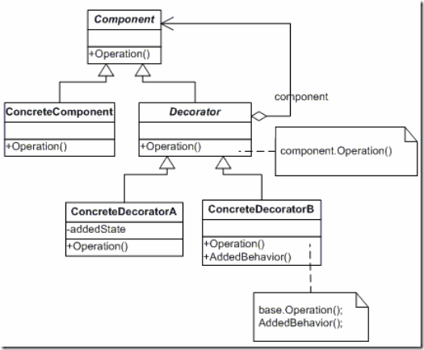

# 装饰器模式(Decorator)
1. 意图：

	动态的给一个对象添加一些额外的职责，就增加功能来说，Decorator模式比生成子类更加的灵活
2. 适用场景：
	1. 需要扩展一个类的功能，或给一个类增加附加责任。
    2. 需要动态的给一个对象增加功能，这些功能可以再动态地撤销。
    3. 需要增加一些基本功能的排列组合而产生的非常大量的功能，从而使继承变得不现实。
3. UML图：
	- 抽象构件(Component)角色：给出一个抽象接口，以规范准备接收附加责任的对象。
    - 具体构件(ConcreteComponent)角色：定义一个将要接收附加责任的类
    - 装饰角色(Decorator)：持有一个构件(Component)对象的实例，并定义一个与抽象构件接口一致的接口
    - 具体装饰角色(ConcreteDecorator)：负责给构件对象“贴上”附加的责任
	

4. 举例应用

	我们假设你现在有一杯奶茶，但是我们知道，我们一般喝奶茶都喜欢加一些，珍珠，椰果，布丁之类的，组合成一杯混合的，当然我们的主体还是奶茶，其他东西都是用来装饰奶茶，为了让他更好喝

5. 注意事项
	- 接口的一致性；装饰对象的接口必须与它所装饰的Component的接口是一致的，因此，所有的ConcreteDecorator类必须有一个公共的父类；这样对于用户来说，就是统一的接口；
	- 省略抽象的Decorator类；当仅需要添加一个职责时，没有必要定义抽象Decorator类。因为我们常常要处理，现存的类层次结构而不是设计一个新系统，这时可以把Decorator向Component转发请求的职责合并到ConcreteDecorator中；
	- 保持Component类的简单性；为了保证接口的一致性，组件和装饰必须要有一个公共的Component类，所以保持这个Component类的简单性是非常重要的，所以，这个Component类应该集中于定义接口而不是存储数据。对数据表示的定义应延迟到子类中，否则Component类会变得过于复杂和臃肿，因而难以大量使用。赋予Component类太多的功能，也使得具体的子类有一些它们它们不需要的功能大大增大；

5. 代码实现

```c++
#include<iostream>
using namespace std;
class milktea{
protected:
	milktea(){}
public:
	virtual ~milktea(){}
public:
	virtual void show_milktea()=0;
};
class concrete_milktea:public milktea{
public:
	concrete_milktea(){}
	virtual ~concrete_milktea(){}
public:
	void show_milktea(){cout<<"I hava a milk_tea"<<endl;}
};

class milktea_decorator: public milktea{
protected:
	milktea_decorator(){}
public:
	virtual ~milktea_decorator(){}
public:
	virtual void show_milktea()=0;
protected:
	milktea* m_milktea;
};

class pearl:public milktea_decorator{
public:
	pearl(milktea* m_milktea){
		this->m_milktea = m_milktea;		
	}
	virtual ~pearl(){}
public:
	void show_milktea(){cout<<"milk_tea with perl"<<endl;}
};
class pudding:public milktea_decorator{
public:
	pudding(milktea* m_milktea){
		this->m_milktea = m_milktea;
	}
	virtual ~pudding(){}
public:
	void show_milktea(){cout<<"milk_tea with pudding"<<endl;}
};
class coconut:public milktea_decorator{
public:
	coconut(milktea* m_milktea){
		this->m_milktea = m_milktea;
	}
	virtual ~coconut(){}
public:
	void show_milktea(){cout<<"milk_tea with coconut"<<endl;}
};
int main()
{
	milktea* pmilktea = new concrete_milktea();
	pmilktea->show_milktea();
	pearl* ppearl = new pearl(pmilktea);
	ppearl->show_milktea();
	
	pudding* ppudding = new pudding(pmilktea);
	ppudding->show_milktea();
	
	coconut* pcoconut = new coconut(pmilktea);
	pcoconut->show_milktea();
}

```

##桥接模式和装饰模式的区别:

二者都是为了防止过度的继承，从而造成子类泛滥的情况。桥接模式的定义是将抽象化与实现化分离（用组合的方式而不是继承的方式），使得两者可以独立变化。可以减少派生类的增长。如果光从这一点来看的话，和装饰者差不多，但两者还是有一些比较重要的区别：

- 桥接模式中所说的分离，其实是指将结构与实现分离（当结构和实现有可能发生变化时）或属性与基于属性的行为进行分离；而装饰者只是对基于属性的行为进行封闭成独立的类，从而达到对其进行装饰，也就是扩展。比如：异常类和异常处理类之间就可以使用桥接模式来实现完成，而不能使用装饰模式来进行设计；如果对于异常的处理需要进行扩展时，我们又可以对异常处理类添加Decorator，从而添加处理的装饰，达到异常处理的扩展，这就是一个桥接模式与装饰模式的搭配；
- 桥接中的行为是横向的行为，行为彼此之间无关联，注意这里的行为之间是没有关联的，就比如异常和异常处理之间是没有行为关联的一样；而装饰者模式中的行为具有可叠加性，其表现出来的结果是一个整体，一个各个行为组合后的一个结果。
