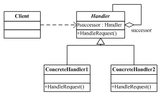

#　责任链模式

## 定义
使多个对象都有机会处理请求，从而避免了请求的发送者和接受者之间的耦合关系。将这些对象链成一条链，并沿着这条链传递该请求/命令，直到有对象处理它为止

## 类图


- 抽象处理者(Handler)角色：
	- 定义一个处理请求的接口
	- 实现后继链
- 具体处理者(ConcreteHandler)角色：
	- 处理它所负责的请求
	- 可以访问它的后继者
	- 如果可以处理该请求就处理否则就将该请求转发给它的后继者

## 适用范围

- 有多个对象可以处理一个请求，哪个对象处理该请求运行时刻自动确定．
- 在不明确接受者的情况下，向多个对象中的一个提交一个请求
- 可以处理一个请求的对象集合应该被动态指定

## 使用实例
比如说一个公司的请假，首先要向部门经理提出了请假，如果请假小于１天，那么部门经理有权利批准，但是如果请假超过三天，部门经理自己职权不够，批不了，部门经理就把申请上交总监，如果请假天数在３天以内，总监自己就能批准，可是如果请假天数超过３天，总监发现自己也批不了，总监就把申请递交的总经理手中，总经理如果同意请假，那么这个假就批下来了．

## 代码
```c++
#include<iostream>
using namespace std;
//抽象管理者
class manager{
public:
	manager(manager* next_manager){_next_manager = next_manager;}
	void set_next_manager(manager* next_manager){_next_manager = next_manager;}
	virtual ~manager(){}
	virtual void request(int days)=0;
protected:
	manager* _next_manager;
};
class teamleader:public manager{
public:
	teamleader(manager* next_manager):manager(next_manager){}
	virtual void request(int days){
		if(days<=1){
			cout<<"部门经理批准请假请求"<<endl;
		}
		else{
			cout<<"部门经理没有权限批准请假超过1天，已提交上级"<<endl;
			_next_manager->request(days);
		}
	}
};
class majordomo:public manager{
public:
	majordomo(manager* next_manager):manager(next_manager){}
	virtual void request(int days){
			if(days<=3){
				cout<<"总监批准请假请求"<<endl;
			}
			else{
				cout<<"总监没有权限批准请假超过3天，已提交上级"<<endl;
				_next_manager->request(days);
			}
	}
};
class general_manager:public manager{
public:
	general_manager(manager* next_manager):manager(next_manager){}
	virtual void request(int days){
		cout<<"总经理批准请假请求"<<endl;
	}
};
int main()
{
	manager* general = new general_manager(NULL);
	manager* major = new majordomo(general);	
	manager* team = new teamleader(major);
	cout<<"请假1天:"<<endl;
	team->request(1);
	cout<<"请假3天:"<<endl;
	team->request(3);
	cout<<"请假10天:"<<endl;
	team->request(10);
}

```
## 注意事项

1. 一个请求到链的最后可能也没有处理，所以一定要配置得当.
2. 责任链模式并不创建责任链。责任链的创建必须由系统的其它部分创建出来。
3. 责任链模式降低了请求的发送端和接收端之间的耦合，使多个对象都有机会处理这个请求。一个链可以是一条线，一个树，也可以是一个环。


## 优缺点
- 降低耦合度：该模式使得一个对象昂无需知道其他哪一个对象处理其请求，对象仅需要知道该请求会被正确的处理，接受者和发送者都没有对方的明确的信息，且链中的对象不知道链的结构
- 增强了给定对象指派职责的灵活性：党对想在分配职责的时候，责任链给你更多的灵活性．你可以通过在运行时刻对该责任链进行动态的增加或者修改来增加或者改变处理一个请求的那些职责
- 不保证被接受：既然一个请求没有明确的接受者，那么就不能保证他一定会被处理，该请求可能一直到链的末端都不能得到处理．